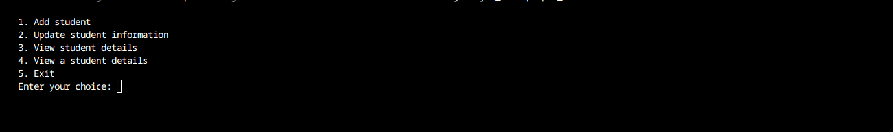

<!-- PROJECT LOGO -->
 

  <h3 align="center">Student Management System</h3>

  

    This project, named "StudentManagement" is a console-based application for managing student information. It includes classes for Student, ValidationUtils, and StudentManagement. The program allows users, through the AdministratorInterface, to add, update, view all, or view details of a specific student. Student data is stored in a file ("students.txt") and loaded upon program execution, demonstrating basic file I/O operations and input validation using static methods in the ValidationUtils class.
     
    <a href="https://github.com/othneildrew/Best-README-Template"><strong>Explore the docs »</strong></a>
     
     
  

<!-- TABLE OF CONTENTS -->

  
Table of Contents

  <ol>
    <li>
      <a href="#about-the-project">About The Project</a>
      <ul>
        <li><a href="#built-with">Built With</a></li>
      </ul>
    </li>
    <li>
      <a href="#getting-started">Getting Started</a>
      <ul>
        <li><a href="#prerequisites">Prerequisites</a></li>
        <li><a href="#installation">Installation</a></li>
      </ul>
    </li>
    <li><a href="#usage">Usage</a></li>
=    <li><a href="#acknowledgments">Acknowledgments</a></li>
  </ol>

<!-- ABOUT THE PROJECT -->
## About The Project
    This project, named "StudentManagement" is a console-based application for managing student information. It includes classes for Student, ValidationUtils, and StudentManagement. The program allows users, through the AdministratorInterface, to add, update, view all, or view details of a specific student. Student data is stored in a file ("students.txt") and loaded upon program execution, demonstrating basic file I/O operations and input validation using static methods in the ValidationUtils class.

(<a href="#readme-top">back to top</a>)

### Built With

This project is built using:

* [Java](https://www.java.com/en/)

(<a href="#readme-top">back to top</a>)

<!-- GETTING STARTED -->
## Getting Started
Please clone this repo or copy the code from AdministratorInterface.java

### Prerequisites

You have to install the java or a code editor. Please refer to the official [java doc](https://www.java.com/en/) for more details

### Installation

There is no additional installation required.

(<a href="#readme-top">back to top</a>)

<!-- USAGE EXAMPLES -->
## Usage

You have to run the project depending on the editor you use.

- All the students will be written inside the students.txt file and you might need to give write access depending on your os.
- You can see the view:
 
- as we can see, you can add, edit, and view students.
- We have predefined all the necessary validations like name length, and age. But you can also change them inside the class of the file, "ValidationUtils", you can see some variables and they are self-explanatory.
- If your terminal supports ASCII, you will be able to see color depending on your type.

## Code Usage

- We have four classes in this project

- Student Model class, responsible for a model of a student, you can define static classes for getting a student information or finding a student
- ValidationUtils class, responsible for type checking and user validation inputs, the static methods inside responsibility is type checking or validation, if fails, the methods will return static variable Error code.
- StudentManagement class, responsible for file loading and saving data updating data, or viewing data that will link with the main class, AdministratorInterface. It will load the file when starting the application using static block and save the data after every data change like update, or add.
- AdministratorInterface class, responsible for main user interface, in some ways middleware and route combination in MVC pattern. It will print the user console with available options, and routes. after the user chooses it will link to static methods inside the class. The methods are responsible for getting necessary data and validating them using validation class, a middleware, and linking to the correct method in StudentManagement, a controller.

So you can think like this in the MVC pattern,
AdministratorInterface class: middleware and routing
StudentManagement class: controller
Student Model class: model
ValidationUtils class: a helper middleware class

(<a href="#readme-top">back to top</a>)

<!-- ACKNOWLEDGMENTS -->
## Acknowledgments

(<a href="#readme-top">back to top</a>)

